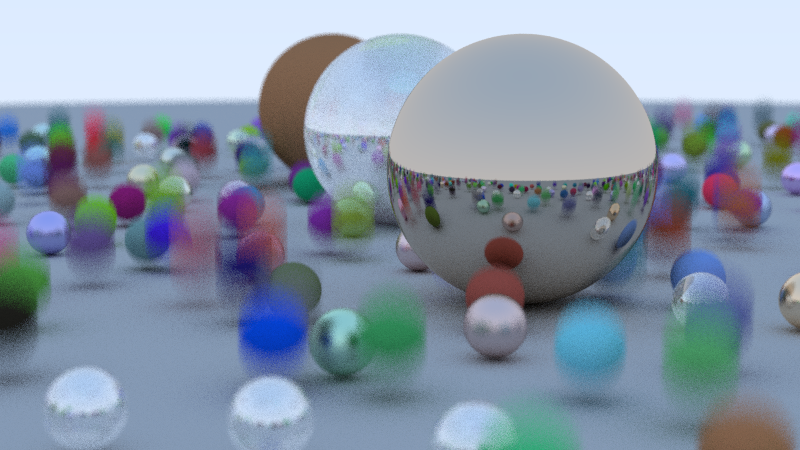
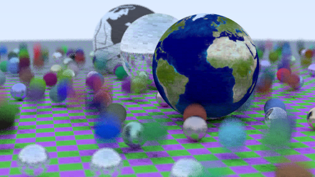
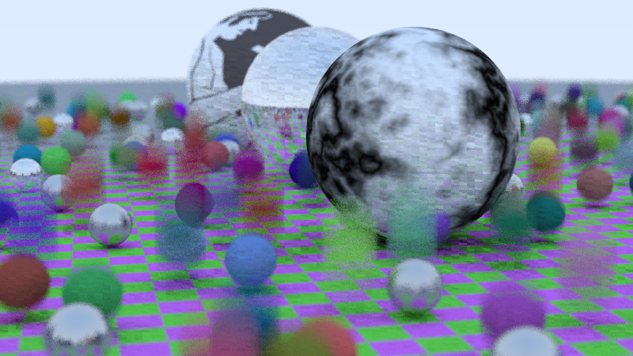
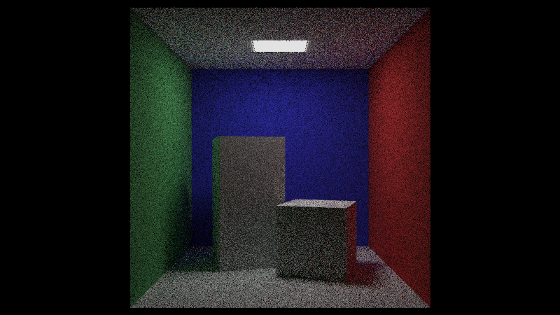
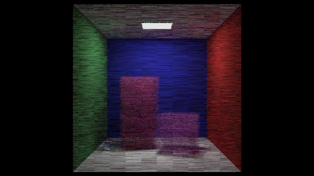
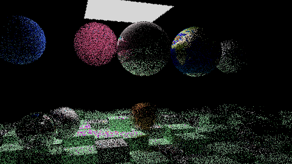

# cuda-raytracer
Simple Port of Raytracing in Series to CUDA

This project is largely insipired from 
[Roger Allen's work](https://github.com/rogerallen/raytracinginoneweekendincuda).

It humbly diverges from it with respect to 2 aspects:

- Build system is now CMake instead of a simple `Makefile`.
- `thrust` is used for handling host side pointers.

With `thrust` the code looks a little more readable in my opinion, 
but for the relatively small scope of this project, I'm not sure if it
makes that much of a difference.

Beware that you would need a relatively new version of CMake (3.18).

The branches of the repository is divided into small chunks to facilitate
the digestion of newly coded material as per the project of Roger Allen.

The overall project structure is also arranged to make it easier to
integrate with other projects.

## Building

Assuming you have clang 9+, cmake 3.18+,  a recent cuda compatible
hardware, and CUDA toolkit (the code base is developped with CUDA 11 but it
should be compatible with previous versions as well, no range reserving, or
managed cudaMallocManaged etc).

- `cd build`

- `ccmake ..`
 
Choose your compiler (clang++) and cuda toolkit location. Then configure and
generate.

- `make install`

Depending on your compute capability gpu card you should modify
`CMakeLists.txt` file.

All of the images below are realized with the following specs:

- Device name: Quadro M2000M
- Memory Clock Rate (KHz): 2505000
- Memory Bus Width (bits): 128
- Peak Memory Bandwidth (GB/s): 80.16

**WARNING: MOST OF THE TIMINGS HERE ARE WRONG**, see `Known Issues`.

Renders the screenshot below at 800 x 600 in 64.8672 seconds with 50 samples
per pixel and 50 bounces per ray.

The one in below at 640x360 in 30.4133 seconds with 20 samples and 10 bounces.

I don't remember the settings for this one. But it includes perlin noise so.

The one in below at 800x450 in ~189 seconds with 500 samples and 100
bounces.

The one in below at 640x360 in 106.365 seconds with 500 samples and 500
bounces

The one in below at 480x270 in 101.325 seconds with 40 samples and 20
bounces

## Features

- Most of what you get in Ray Tracing In One Weekend and in Next Week.

- Multiple images in different sizes and channels.

- Perlin Noise

- Constant Medium Volume Rendering

- A simple GPU friendly acceleration structure, a.k.a DA List, Foley et. al.,
  2013, p. 1081.

## Planned

- Asset loading with assimp.
- Hopefully pdf handling in near feature.
- Background handling.

## Known Issues

I managed to fix the rng problem around nw-final branch.  It was such a simple
fix that i kind of feel stupid to let it sit there for so long.

For previous branches, just change the line

- `rcolor += ray_color(r, world, randState, bounceNb);` to

- `rcolor += ray_color(r, world, &localS, bounceNb);`

This increased significantly the rendering times so all of the rendering times
above are compromised. By significantly, I mean it increases about two times
more. 

Cheers
