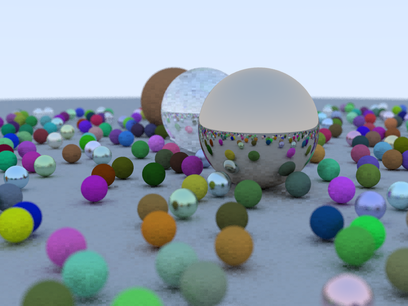

# cuda-raytracer
Simple Port of Raytracing in Series to CUDA

This project is largely insipired from 
[Roger Allen's work](https://github.com/rogerallen/raytracinginoneweekendincuda).

It humbly diverges from it with respect to 2 aspects:

- Build system is now CMake instead of a simple `Makefile`.
- `thrust` is used for handling host side pointers.

With `thrust` the code looks a little more readable in my opinion, 
but for the relatively small scope of this project, I'm not sure if it
makes that much of a difference.

Beware that you would need a relatively new version of CMake (3.18).

The branches of the repository is divided into small chunks to facilitate
the digestion of newly coded material as per the project of Roger Allen.

The overall project structure is also arranged to make it easier to
integrate with other projects.

Renders the screenshot below at 800 x 600 in 32.3065 seconds with 50 samples
per pixel and 50 bounces per ray.

The one in below at 640x360 in 30.4133 seconds with 20 samples and 10 bounces.

## Features

- Most of what you get in Ray Tracing In One Weekend.

- Multiple images in different sizes and channels.

## Planned

- Most of Ray Tracing Next Week 
- Asset loading with assimp.
- A simple acceleration structure.
- Hopefully pdf handling in near feature.
- Background handling.

## Known Issues

- A Better RNG.

Cheers
